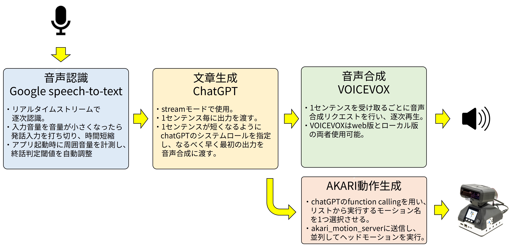
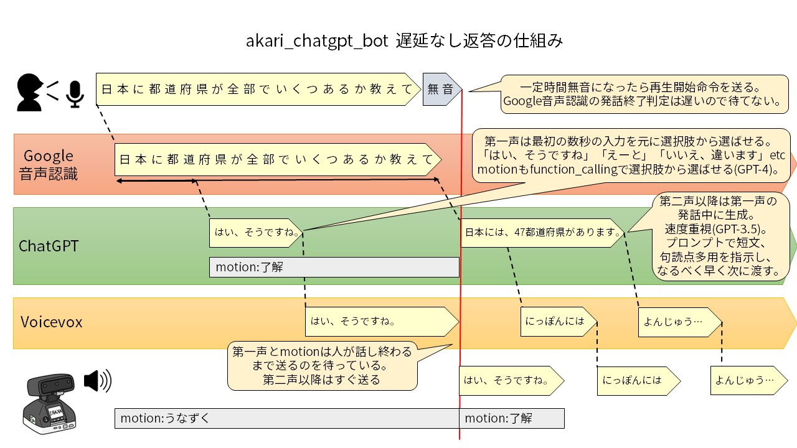
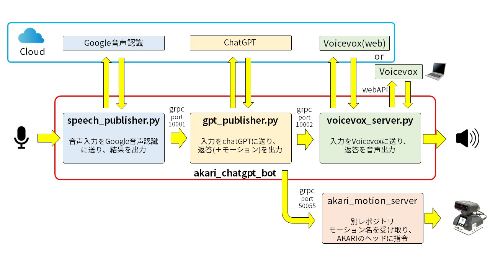

# akari_chatgpt_bot
音声認識、文章生成、音声合成を使って対話するチャットボットアプリです。  

## 動作確認済み環境
AKARI上で動作確認済み。  
`chatbot_akari.py`以外はUbuntu22.04環境であれば使用可能です。  
**マイクとスピーカーは別途外付けする必要があります。**  

## セットアップ
1. submoduleの更新  
`git submodule update --init`  

1. ライブラリのインストール  
`sudo apt install python3.10 python3.10-venv portaudio19-dev gnome-terminal`  

1. 仮想環境の作成  
`python3 -m venv venv`  
`. venv/bin/activate`  
`pip install -r requirements.txt`  

1. (音声認識を使う場合) Cloud Speech-to-Text APIの有効化、秘密鍵ダウンロード  
Google cloud consoleに登録し、Cloud Speech-to-Text APIを有効化する。  
ユーザーをCloud Speech 管理者に登録する。  
認証用のjsonをダウンロードし、~/.bashrcにパスを記述  
`export GOOGLE_APPLICATION_CREDENTIALS=/home/xxx/xxx.json`  
プロジェクトIDを~/.bashrcに記述  
`export GOOGLE_SPEECH_PROJECT_ID="xxxxxxxxxxx"`

1. (chatGPTの文章生成を使う場合)OPENAI API KEYの作成   
[OPENAI](https://openai.com/)にてユーザ登録しAPI KEYを作成し、~/.bashrcに自身のkeyを記述  
`export OPENAI_API_KEY=sk-xxxxxxxxxxxxxxx`  

1. (Claudeの文章生成を使う場合)ANTHROPIC API KEYの作成   
[ANTHROPIC](https://www.anthropic.com/)にてユーザ登録しAPI KEYを作成し、~/.bashrcに自身のkeyを記述  
`export ANTHROPIC_API_KEY=sk-xxxxxxxxxxxxxxx`  

1. (Geminiの文章生成を使う場合)GEMINI API KEYの作成   
[Google AI Studio](https://ai.google.dev/aistudio)にてユーザ登録しAPI KEYを作成し、~/.bashrcに自身のkeyを記述  
`export GEMINI_API_KEY=xxxxxxxxxxxxxxx`  

1. (VoiceVox web版の音声合成を使う場合) VOICEVOX web版のAPI KEYの作成
[WEB版VOICEVOX API（高速）](https://voicevox.su-shiki.com/su-shikiapis/) にてapikeyを作成し、~/.bashrcに自身のkeyを記述  
`export VOICEVOX_API_KEY='xxxxxxxxxxxxxxx`  

1. (VoiceVoxの音声合成を使う場合) VOICEVOXのダウンロード  
[VOICEVOX](https://voicevox.hiroshiba.jp/)をダウンロード、インストールする。  
AKARIでVOICEVOXのローカル版を使う場合、AKARI本体内のCPUでVOICEVOXを実行すると処理時間がかかるので、リモートPC上(特にGPU版)でVOICVOXを実行することを推奨する。  
その場合下記を参考にdocker pullを行う。  
(CPU版)  
`docker pull voicevox/voicevox_engine:cpu-ubuntu20.04-latest`  
(nvidia GPU版)  
`docker pull voicevox/voicevox_engine:nvidia-ubuntu20.04-latest`  

1. (Style-Bert-VITS2の音声合成を使う場合) Style-Bert-VITS2のセットアップ  
[Style-Bert-VITS2](https://github.com/litagin02/Style-Bert-VITS2)のREADMEに沿ってセットアップする。

 し、下記のコマンドでFastAPIサーバを起動する。  
`python3 server_fastapi.py`  
AKARIなどで動かす場合は、同一ネットワーク内の外部PC上にサーバーを立てることを推奨。  

1. (AivisSpeechの音声合成を使う場合) AivisSpeech Engineのセットアップ  
AKARI本体内のCPUでAivisSpeech Engineを実行すると処理時間がかかるので、リモートPC上(特にGPUありのPC)で実行することを推奨する。  
下記の手順でセットアップ  
`git clone https://github.com/Aivis-Project/AivisSpeech-Engine.git`  
`cd AivisSpeech-Engine`  
`docker build ./ -t aivis`  
`docker run -it -p 10101:10101 aivis`

下記のコマンドでFastAPIサーバを起動する。  
`poetry run python3.11 run.py --use_gpu`  

1. (AKARIのモーション再生を使う場合) akari_motion_serverのセットアップ  
`git clone https://github.com/AkariGroup/akari_motion_server`  
akari_motion_server内のREADME.mdに沿ってセットアップする。  

## VOICEVOXをOSS版で使いたい場合  
AKARIでVOICEVOXのローカル版を使う場合、AKARI本体内のCPUでVOICEVOXを実行すると処理時間がかかるので、リモートPC上(特にGPU版)でVOICVOXを実行することを推奨する。  
その場合下記を参考にdocker pullを行う。  
(CPU版)  
`docker pull voicevox/voicevox_engine:cpu-ubuntu20.04-latest`  
(nvidia GPU版)  
`docker pull voicevox/voicevox_engine:nvidia-ubuntu20.04-latest`  

上記でVOICEVOXを起動した後、AKARI上で"--voicevox_host"にこのPCのIPアドレスを指定する。  

## 実行準備
1. 音声合成を使う場合、実行したい環境に合わせて下記を起動する。  
   (VoiceVox web版)  
      特に起動は不要。  
   (VoiceVox)  
      (CPU版)  
      `docker run --rm -it -p '{VOICEVOXを起動するPC自身のIPアドレス}:50021:50021' voicevox/voicevox_engine:cpu-ubuntu20.04-latest`  
      (nvidia GPU版)  
      `docker run --rm --gpus all -p '{VOICEVOXを起動するPC自身のIPアドレス}:50021:50021' voicevox/voicevox_engine:nvidia-ubuntu20.04-latest`  
   (Style-Bert-VITS2)  
      Style-Bert-VITS2のディレクトリ直下で下記を実行  
      `python3 server_fastapi.py`  
   (AivisSpeech)
      AivisSpeech Engineのディレクトリ直下で下記を実行  
      `poetry run python3.11 run.py --use_gpu`  

## サンプルの実行

### 音声認識のサンプル  
マイクへの発話を文章に変換  
`python3 speech_to_text_example.py`  
   引数は下記が使用可能  
   - `-t`,`--timeout`: マイク入力がこの時間しきい値以下になったら音声入力を打ち切る。デフォルトは0.5[s]。短いと応答が早くなるが不安定になりやすい。  
   - `-p`,`--power_threshold`: マイク入力の音量しきい値。デフォルトは0で、0の場合アプリ起動時に周辺環境の音量を取得し、そこから音量しきい値を自動決定する。  
   - `--v2`: この引数をつけると、google sppech-to-text v2を使用する。引数がない場合はgoogle sppech-to-text v1を使用する。  

### chatGPTのサンプル  
キーボード入力した文章に対してchatGPTで返答を作成  
`python3 chatgpt_example.py`  

   引数は下記が使用可能  
   - `-m`, `--model`: 使用するモデル名を指定可能。モデル名はOpenaiもしくはAnthropicのものが選択可能。モデル名を羅列することで、全モデルに対して一括で問いかけが可能。  
   例) `python3 chatgpt_example.py -m gpt-3.5-turbo-0125 gpt-4-turbo-preview claude-3-sonnet-20240229 claude-3-opus-20240229`  

### 音声合成(VOICEVOX)のサンプル  
キーボード入力した文章を音声合成で発話  

`python3 voicevox_example.py`  

   引数は下記が使用可能  
   - `--voicevox_local`: このオプションをつけた場合、voicevoxのweb版ではなくローカル版を実行する。  
   - `--voicevox_host`: `--voicevox_local`を有効にした場合、ここで指定したhostのvoicevoxにリクエストを送信する。デフォルトは"127.0.0.1"なのでlocalhostのvoicevoxを利用する。  
   - `--voicevox_port`: `--voicevox_local`を有効にした場合、ここで指定したportのvoicevoxにリクエストを送信する。デフォルトは50021。  

### 音声合成(Style-BERT-VITS2)のサンプル  
キーボード入力した文章を音声合成で発話  

`python3 style_bert_vits_example.py`  

   引数は下記が使用可能  
   - `--voice_host`: ここで指定したhostの`server_fastapi.py`にリクエストを送信する。デフォルトは"127.0.0.1"  
   - `--voice_port`: ここで指定したportの`server_fastapi.py`にリクエストを送信する。デフォルトは5000。  

### 音声合成(Aivis Speech)のサンプル  
キーボード入力した文章を音声合成で発話  

`python3 aivis_example.py`  

   引数は下記が使用可能  
   - `--voice_host`: ここで指定したhostにリクエストを送信する。デフォルトは"127.0.0.1"  
   - `--voice_port`: ここで指定したportにリクエストを送信する。デフォルトは10101。  

### 英単語→カナ変換のサンプル
キーボード入力した文章内の英単語をカタカナに変換する。
対話bot内では、英単語をカタカナに変換してから音声合成で発話するようになっており、その機能のサンプル。

`python3 text_to_kana_example.py`

## 音声対話の実行
実行後、ターミナルでEnterキーを押し、マイクに話しかけると返答が返ってくる。  

### 音声対話  
`python3 chatbot.py`  

### 音声対話+AKARIのモーション再生  
`python3 chatbot_akari.py`  

引数は下記が使用可能  
- `-t`,`--timeout`: マイク入力がこの時間しきい値以下になったら音声入力を打ち切る。デフォルトは0.5[s]。短いと応答が早くなるが不安定になりやすい。  
- `-p`,`--power_threshold`: マイク入力の音量しきい値。デフォルトは0で、0の場合アプリ起動時に周辺環境の音量を取得し、そこから音量しきい値を自動決定する。  
- `--v2`: この引数をつけると、google sppech-to-text v2を使用する。引数がない場合はgoogle sppech-to-text v1を使用する。  
- `-m`, `--model`: 使用するモデル名を指定可能。モデル名はOpenAI, Anthropic, Geminiのものが選択可能。  
- `--voicevox_local`: このオプションをつけた場合、voicevoxのweb版ではなくローカル版を実行する。  
- `--voice_host`: `--voicevox_local`を有効にした場合、ここで指定したhostのvoicevoxにリクエストを送信する。デフォルトは"127.0.0.1"なのでlocalhostのvoicevoxを利用する。  
- `--voice_port`: `--voicevox_local`を有効にした場合、ここで指定したportのvoicevoxにリクエストを送信する。デフォルトは50021。  

## 遅延なし音声対話botの実行

### 概要

発話の最初の数文字を認識した時点で選択肢から返答を作成しておくことで、第一声を遅延なく返答する方法です。  

### 全体図

Google音声認識、chatGPT、Voicevoxとのやり取りをする各アプリは個別に動作しており、各アプリ間はgrpcで通信しています。  

### 起動方法
必ず、上記実行準備で音声合成を起動させておくこと。  

1. (AKARIのモーション再生を行う場合)akari_motion_serverを起動する。  
   起動方法は https://github.com/AkariGroup/akari_motion_server を参照。  

以下2は使用する音声合成の種類によって分岐する。  

**音声合成にVOICEVOXを使う場合**  

2. `voicevox_server` を起動する。(Voicevoxへの送信サーバ)  
   `python3 voicevox_server.py`  

   引数は下記が使用可能  
   - `--voicevox_local`: このオプションをつけた場合、voicevoxのweb版ではなくローカル版を実行する。  
   - `--voice_host`: `--voicevox_local`を有効にした場合、ここで指定したhostのvoicevoxにリクエストを送信する。デフォルトは"127.0.0.1"なのでlocalhostのvoicevoxを利用する。  
   - `--voice_port`: `--voicevox_local`を有効にした場合、ここで指定したportのvoicevoxにリクエストを送信する。デフォルトは50021。  

**音声合成にStyle-Bert-VITS2を使う場合**  

2. `style_bert_vits_server`を起動する。(Style-Bert-VITS2への送信サーバ)  
   `python3 style_bert_vits_server.py`  

   引数は下記が使用可能  
   - `--voice_host`: ここで指定したhostの`server_fastapi.py`にリクエストを送信する。デフォルトは"127.0.0.1"  
   - `--voice_port`: ここで指定したportの`server_fastapi.py`にリクエストを送信する。デフォルトは5000。  

**音声合成にAivis Speechを使う場合**  

2. `aivis_server`を起動する。(Aivis Speechへの送信サーバ)  
   `python3 aivis_server.py`  

   引数は下記が使用可能  
   - `--voice_host`: ここで指定したhostにリクエストを送信する。デフォルトは"127.0.0.1"
   - `--voice_port`: ここで指定したportにリクエストを送信する。デフォルトは10101。

3. `gpt_publisher`を起動する。(ChatGPTへリクエストを送信し、受信結果を音声合成サーバへ渡す。)  
   `python3 gpt_publisher.py`  

   引数は下記が使用可能  
   - `--ip`: gpt_serverのIPアドレス。デフォルトは"127.0.0.1"
   - `--port`: gpt_serverのポート。デフォルトは"10001"

4. speech_publisher.pyを起動する。(Google音声認識の結果をgpt_publisherへ渡す。)  
   `python3 speech_publisher.py`  

   引数は下記が使用可能  
   - `--robot_ip`: akari_motion_serverのIPアドレス。デフォルトは"127.0.0.1"
   - `--robot_port`: akari_motion_serverのポート。デフォルトは"50055"
   - `--gpt_ip`: gpt_serverのIPアドレス。デフォルトは"127.0.0.1"
   - `--gpt_port`: gpt_serverのポート。デフォルトは"10001"
   - `--voicevox_ip`: voicevox_serverのIPアドレス。デフォルトは"127.0.0.1"
   - `--voicevox_port`: voicevox_serverのポート。デフォルトは"10002"
   - `-t`,`--timeout`: マイク入力がこの時間しきい値以下になったら音声入力を打ち切る。デフォルトは0.5[s]。短いと応答が早くなるが不安定になりやすい。  
   - `-p`,`--power_threshold`: マイク入力の音量しきい値。デフォルトは0で、0の場合アプリ起動時に周辺環境の音量を取得し、そこから音量しきい値を自動決定する。  
   - `--progress_report_len`: 音声認識の文字数がここで入力した数値以上になると、一旦gpt_publisherに認識結果を送り、第一声とモーションを生成する(遅延なし応答用)。0にすると無効。デフォルトは8。
   - `--no_motion`: このオプションをつけた場合、音声入力中のうなずき動作を無効化する。  
   - `--auto`: 自動モードの有効化。通常キーボードでEnterキーを入力するまで待つが、この引数をつけるとEnterキーの入力をスキップする。  
   - `--v2`: この引数をつけると、google sppech-to-text v2を使用する。引数がない場合はgoogle sppech-to-text v1を使用する。  

5. `speech_publisher.py`のターミナルでEnterキーを押し、マイクに話しかけると返答が返ってくる。

### auto modeでの実行について
上記4.の `speech_publisher.py`に`--auto`オプションをつけて起動すると音声入力前のEnterキー入力をスキップできるが、この場合マイクの設置位置や種類によっては自身の合成音声を認識してしまう。
そのような環境では、下記`talk_controller_client`を起動することで、ロボット側が音声出力中は音声認識をストップすることができる。

`python3 talk_controller_client.py`

### スクリプトで一括起動する方法

必ず、上記実行準備で音声合成を起動させておくこと。  

**音声合成にVOICEVOXを使う場合**  
(通常モード)  
1. スクリプトを実行する。  

   `cd script`  
   `./faster_chatbot.sh {1.でVoicevoxを起動したPCのIPアドレス} {akari_motion_serverのパス}`  

   akari_motion_serverのパスを入力しなければ、akari_motion_serverは起動せず、モーションの再生は行われません(AKARI以外でも使えます)。  

2. `speech_publisher.py`のターミナルでEnterキーを押し、マイクに話しかけると返答が返ってくる。

(自動モード)  
1. スクリプトを実行する。  

   `cd script`  
   `./faster_chatbot_auto.sh {1.でVoicevoxを起動したPCのIPアドレス} {akari_motion_serverのパス}`  

   akari_motion_serverのパスを入力しなければ、akari_motion_serverは起動せず、モーションの再生は行われません(AKARI以外でも使えます)。  

**音声合成にStyle-Bert-VITS2を使う場合**  
(通常モード)  
1. スクリプトを実行する。  
   `cd script`  
   `./faster_chatbot_bert_vits.sh {2.でStyle-Bert-VITS2を起動したPCのIPアドレス} akari_motion_serverのパス}`  

   akari_motion_serverのパスを入力しなければ、akari_motion_serverは起動せず、モーションの再生は行われません(AKARI以外でも使えます)。  

2. `speech_publisher.py`のターミナルでEnterキーを押し、マイクに話しかけると返答が返ってくる。  

(自動モード)  
1. スクリプトを実行する。  
   `cd script`  
   `./faster_chatbot_bert_vits_auto.sh {2.でStyle-Bert-VITS2を起動したPCのIPアドレス} akari_motion_serverのパス}`  

   akari_motion_serverのパスを入力しなければ、akari_motion_serverは起動せず、モーションの再生は行われません(AKARI以外でも使えます)。  

## その他
Voicevoxの音声合成では、デフォルトの音声として「VOICEVOX:春日部つむぎ」を使用しています。  
